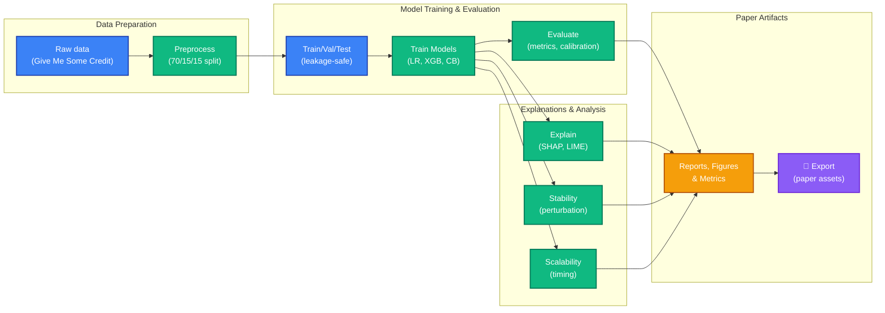
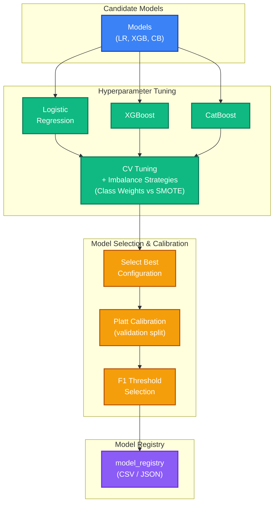
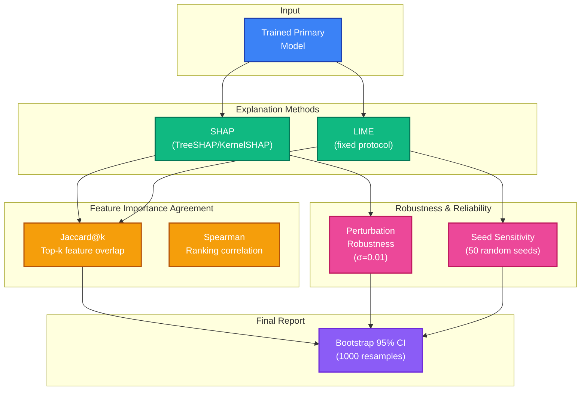
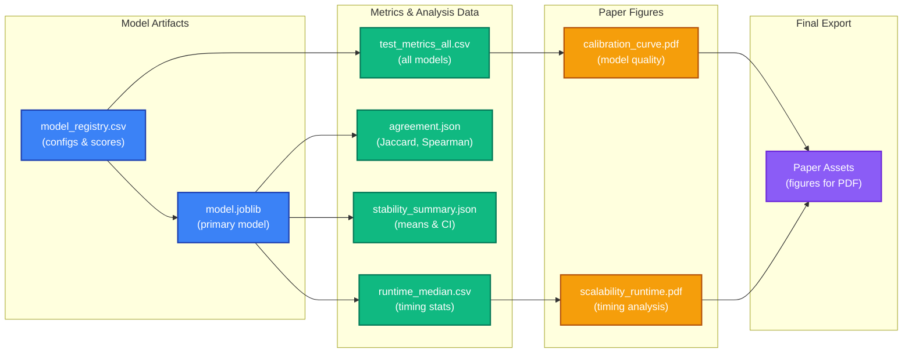

# Interpreting Credit Risk - ICR Code

Code for the manuscript:
Stability, Scalability, and Agreement: A Systematic Comparison of SHAP and LIME for Loan Default Prediction.

## What this repository enforces

- Single-dataset workflow (Give Me Some Credit).
- Leakage-safe split and preprocessing: stratified 70/15/15, train-only preprocessing stats.
- Multi-model benchmark: logistic regression, XGBoost, CatBoost.
- Imbalance strategy comparison inside training: class weights vs SMOTE-inside-CV.
- Platt calibration and threshold selection on validation split.
- Explanation protocol: TreeSHAP for tree models, KernelSHAP for logistic path, LIME with fixed protocol.
- Agreement and stability outputs with bootstrap confidence intervals.
- Scalability timing with repeated runs and median summary.

## System architecture

### 1) End-to-end pipeline



### 2) Model training and selection



### 3) Explanation, agreement, stability



### 4) Artifact graph



## Commands

```bash
uv sync
python main.py run-paper-protocol --config configs/base.yaml
python main.py export-paper-assets --config configs/base.yaml --paper-figures-dir ../figures
```

Stage-wise execution:

```bash
python main.py prepare-data --config configs/base.yaml
python main.py train --config configs/base.yaml
python main.py evaluate --config configs/base.yaml
python main.py explain --config configs/base.yaml
python main.py explain-sweep --config configs/base.yaml
python main.py stability --config configs/base.yaml
python main.py scalability --config configs/base.yaml
python main.py report --config configs/base.yaml
```

## Paper parity checklist

- Split protocol: `data.test_size=0.15`, `data.val_size=0.15`, fixed seed.
- CV protocol: `models.cv_folds=5`, stratified.
- Imbalance protocol: `models.compare_imbalance_strategies=true`.
- Calibration protocol: Platt sigmoid during training and calibration curve in evaluation.
- Agreement protocol: `explain.top_k=3`, `stability.bootstrap_samples=1000`.
- LIME protocol: `lime_num_samples_sweep=[500,1000,5000]`, `lime_seed_count=50`, `lime_kernel_width=sqrt_features`.
- Perturbation protocol: `stability.perturbation_sigma=0.01`.
- Scalability protocol: `scalability.repeats=5`, includes `22500` point.

## Key outputs

- Models: `artifacts/models/model_registry.csv`, `artifacts/models/model_registry.json`, `artifacts/models/model.joblib`.
- Predictive metrics: `artifacts/metrics/test_metrics_all.csv`, `artifacts/metrics/test_metrics.json`.
- Explanations: `artifacts/explanations/shap_local_abs.csv`, `artifacts/explanations/lime_local_abs.csv`, `artifacts/explanations/agreement.json`.
- Stability: `artifacts/stability/lime_seed_stability.csv`, `artifacts/stability/stability_summary.json`.
- Scalability: `artifacts/scalability/runtime_raw.csv`, `artifacts/scalability/runtime_median.csv`.
- Paper figures: `artifacts/reports/figures/calibration_curve.pdf`, `artifacts/reports/figures/scalability_runtime.pdf`.

## Notes for manuscript sync

- Explanations run on full test set when `explain.use_full_test_for_explanations=true`.
- The primary explanation model is controlled by `models.model_name`.
- `export-paper-assets` copies generated PDFs into the folder consumed by `paper.tex`.
