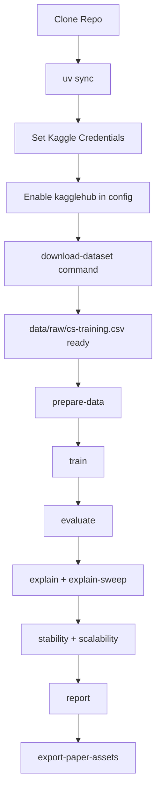

# Clone to Dataset Download to Full Run

This guide covers the complete workflow from cloning the project to downloading the Kaggle competition dataset and running the full pipeline.

## 1) Clone the repository

```bash
git clone <your-repo-url>
cd ICR_code
```

## 2) Install dependencies

This project uses uv and reads dependencies from pyproject.toml.

```bash
uv sync
```

## 3) Set Kaggle credentials

KaggleHub needs Kaggle credentials. Use one of these methods.

Option A: environment variables

```bash
# PowerShell
$env:KAGGLE_USERNAME="your_username"
$env:KAGGLE_KEY="your_api_key"
```

Option B: Kaggle token file

- Create ~/.kaggle/kaggle.json (or %USERPROFILE%/.kaggle/kaggle.json on Windows)
- File content:

```json
{"username": "your_username", "key": "your_api_key"}
```

## 4) Enable dataset download in config

Edit configs/base.yaml and set:

```yaml
kagglehub:
  enabled: true
  competition: "GiveMeSomeCredit"
  competition_file: "cs-training.csv"
  force_download: false
  overwrite_existing: false
```

Notes:
- competition is the Kaggle competition slug used by kagglehub.competition_download(...).
- competition_file is copied from the Kaggle cache directory into data/raw/<data.input_file>.

## 5) Download dataset explicitly (recommended first run)

```bash
python main.py download-dataset --config configs/base.yaml
```

What this does:
- Calls kagglehub.competition_download("GiveMeSomeCredit")
- Copies the configured file (default: cs-training.csv) into data/raw/cs-training.csv

## 6) Prepare data and run stages

```bash
python main.py prepare-data --config configs/base.yaml
python main.py train --config configs/base.yaml
python main.py evaluate --config configs/base.yaml
python main.py explain --config configs/base.yaml
python main.py explain-sweep --config configs/base.yaml
python main.py stability --config configs/base.yaml
python main.py scalability --config configs/base.yaml
python main.py report --config configs/base.yaml
```

## 7) Run everything in one command

```bash
python main.py run-paper-protocol --config configs/base.yaml
```

If kagglehub.enabled=true, prepare-data will also attempt dataset download before loading raw data.

## 8) Export paper figures

```bash
python main.py export-paper-assets --config configs/base.yaml --paper-figures-dir ../figures
```

## 9) Common issues

- Missing kagglehub package: run uv sync.
- Not authenticated to Kaggle: set KAGGLE_USERNAME/KAGGLE_KEY or kaggle.json.
- File not found after download: verify kagglehub.competition_file matches the downloaded file name.
- Existing raw file not replaced: set kagglehub.overwrite_existing=true or kagglehub.force_download=true.

## Process Diagram


